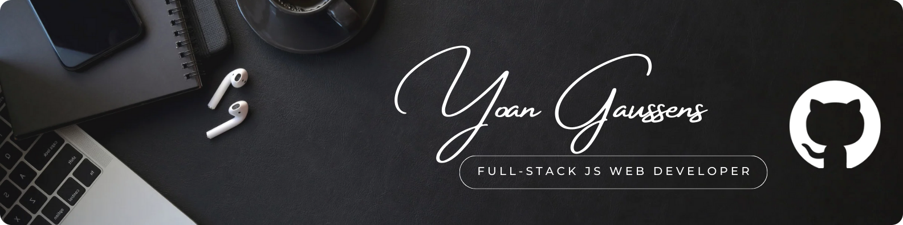

  

  
🇬🇧 English

  

     
  

  # 👨‍💻 Who am I?

  I am a full-stack web developer with a professional qualification : **Développeur Web et Web Mobile (DWWM)**. 
  Passionate about the world of development and digital technologies, I love bringing ideas to life by building real-world projects. What drives me is exploring new technologies and taking on technical challenges on a daily basis.

   

  ### 🔍 Curious and motivated

  Always seeking new knowledge, I am constantly looking to learn and grow :

  - **Continuous learning** : I constantly explore new tools and technologies to enhance my skills and adapt to emerging trends.
  - **Creativity and innovation** : I use every personal project as an opportunity to push boundaries and test new ideas.

   

  ### 🎯 My goals

  I am seeking opportunities that will allow me to continue developing my skills and contribute to innovative projects. My main goals are :

  - **Become a versatile developer** : Improve my skills and master new tools to meet a variety of needs.
  - **Contribute to impactful projects** : Work on digital solutions that bring real value.
    
   

  ### 🤝 What I can bring
  
  In addition to my development skills, I am known for :

  - **My adaptability** : I quickly integrate into diverse environments and am a fast learner.
  - **My total commitment** : Whether working solo or as part of a team, I fully invest myself to deliver quality results.

   

  ---

   

  # 🛠️ Tools I Use

  #### Frontend
  
  
  
  
   
  
  
  
  

  #### Backend
  
  
  
  
   
  
  
  
  

  #### Miscellaneous
  
  
  
  
   
  
  
  
  

   

  ---

   

  ## 📊 Stats GitHub:

  

    
      
  

  
🇫🇷 Français

  

    
  

  # 👨‍💻 Qui suis-je ?

  Je suis développeur web full-stack diplômé du titre professionnel **Développeur Web et Web Mobile (DWWM)**. 
  Passionné par l'univers du développement et des technologies du numérique en général, j’aime donner vie à des idées en réalisant des projets concrets. Ce qui me motive, c’est d’explorer de nouvelles technologies et de relever des défis techniques au quotidien.

   

  ### 🔍 Curieux et motivé

  Toujours en quête de nouvelles connaissances, je cherche en permanence à apprendre et progresser : 

  - **Apprentissage continu** : J’explore sans cesse de nouveaux outils et technologies pour améliorer mes compétences et m’adapter aux nouvelles tendances.
  - **Créativité et innovation** : Je profite de chaque projet personnel pour repousser les limites et tester des idées nouvelles.
  
   

  ### 🎯 Mes objectifs

  Je suis à la recherche d'opportunités qui me permettront de continuer à développer mes compétences et de contribuer à des projets innovants. Mes principaux objectifs :

  - **Devenir un développeur polyvalent** : Améliorer mes compétences et maîtriser de nouveaux outils afin de pouvoir répondre à une variété de besoins.
  - **Contribuer à des projets impactants** : Travailler sur des solutions digitales qui apportent une réelle valeur ajoutée.

   

  ### 🤝 Ce que je peux apporter

  En plus de mes compétences en développement, je suis reconnu pour :

  - **Mon adaptabilité** : Je m’intègre rapidement dans des environnements variés et apprends vite.
  - **Mon investissement total** : Que ce soit en solo ou en équipe, je m’implique pleinement pour des résultats de qualité.

   

  ---

   

  # 🛠️ Les outils que j'utilise

  #### Frontend
  
  
  
  
   
  
  
  
  

  #### Backend
  
  
  
  
   
  
  
  
  

  #### Divers
  
  
  
  
   
  
  
  
  

   

  ---

   

  ## 📊 Stats GitHub:

  

    
      
  

